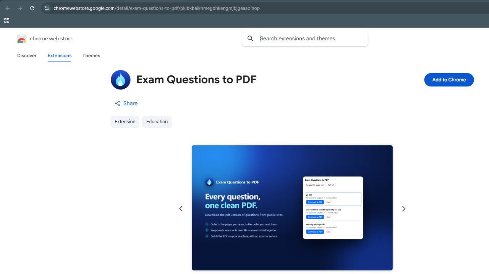
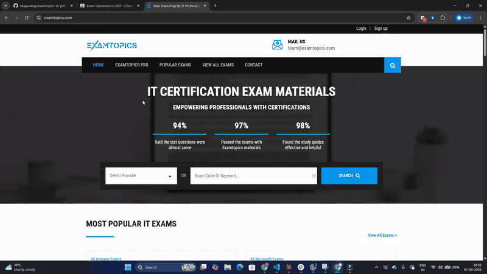

# Exam Questions to PDF (Chrome extension)

**[Install from the Chrome Web Store](https://chromewebstore.google.com/detail/exam-questions-to-pdf/pkibkbaiknmegdhkengmjbjgeaaoihop)**
- (Note: It works on pages you can access, so you or your friend need to have atleast contributor test engine access. Then you will be able to visit those pages and download them as PDF.)

[](https://chromewebstore.google.com/detail/exam-questions-to-pdf/pkibkbaiknmegdhkengmjbjgeaaoihop)



[Watch the demo video](assets/examtopics%20to%20pdf.mp4)


Helps save exam `/view` pages on the configured sites as you browse them, then exports each exam as its own PDF - one file per exam.
**Install:** `chrome://extensions` → turn on **Developer mode** → **Load unpacked** → select `extension/`, then pin it so the badge is visible.


## Config + build

`.env` is the **build-time** source of truth - Chrome cannot read it at runtime. Keys: `SCRAPE_HOSTS`, `SCRAPE_SCHEMES`, `VIEW_PATH_PATTERN`. Copy `.env.sample` (the committed template, and the file to read/edit) to `.env`; `.env` is gitignored.
```bash
node build.js
```

Then hit **Reload** on the extension at `chrome://extensions`. The build regenerates `extension/sites.generated.js` and patches `host_permissions` / `content_scripts.matches` in `extension/manifest.json` — never edit generated files by hand.
